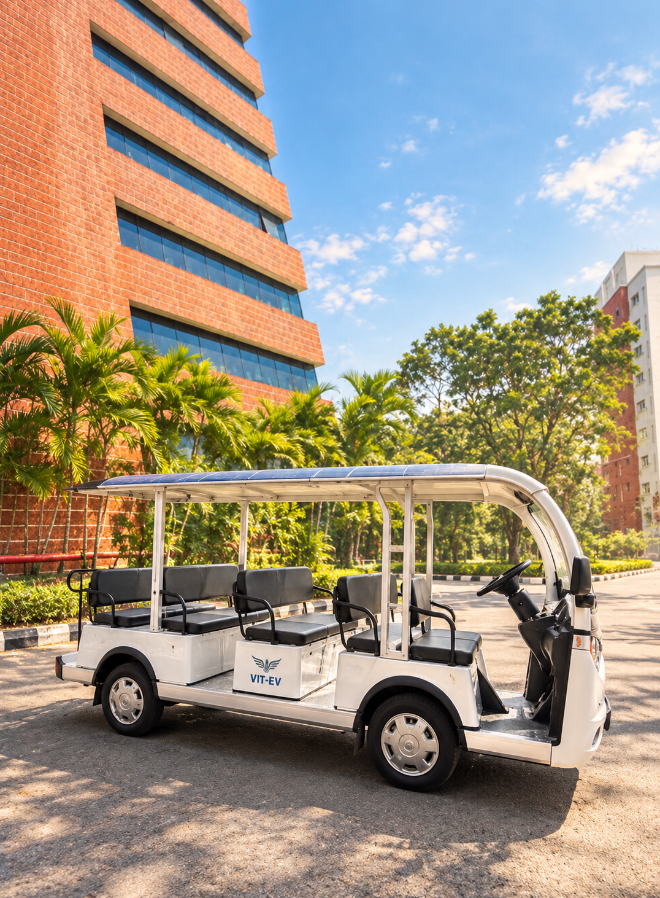
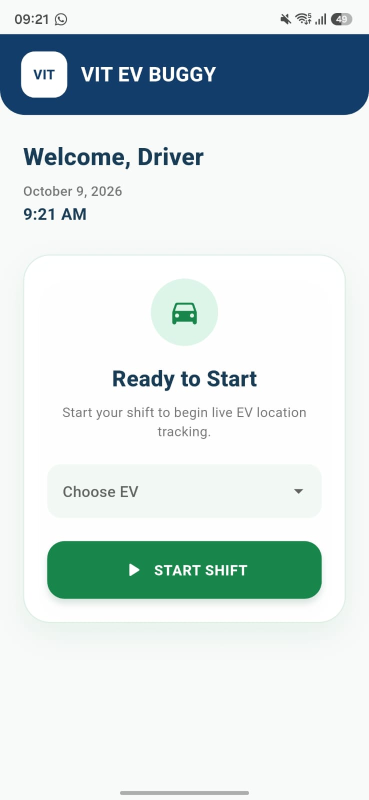
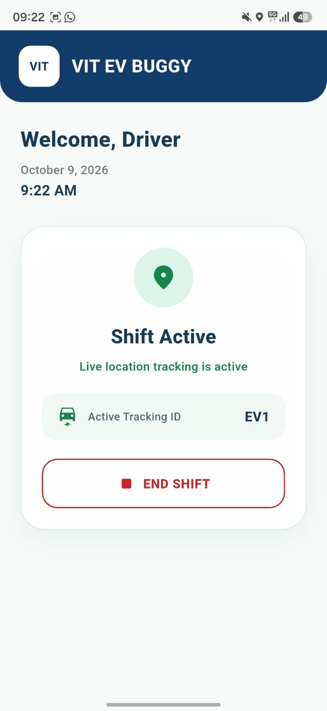
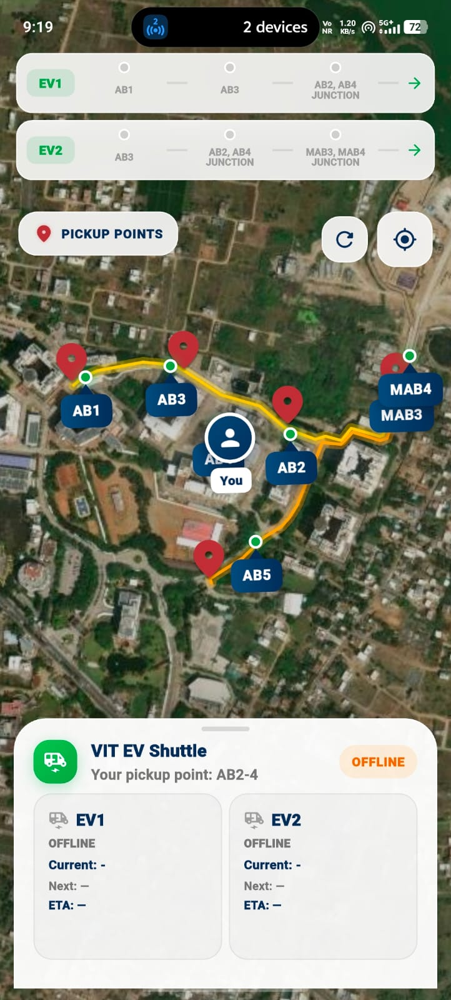
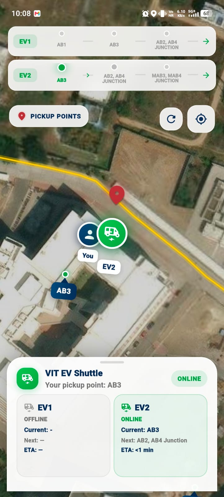
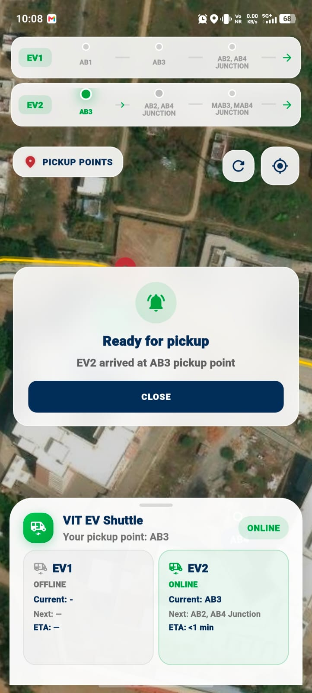
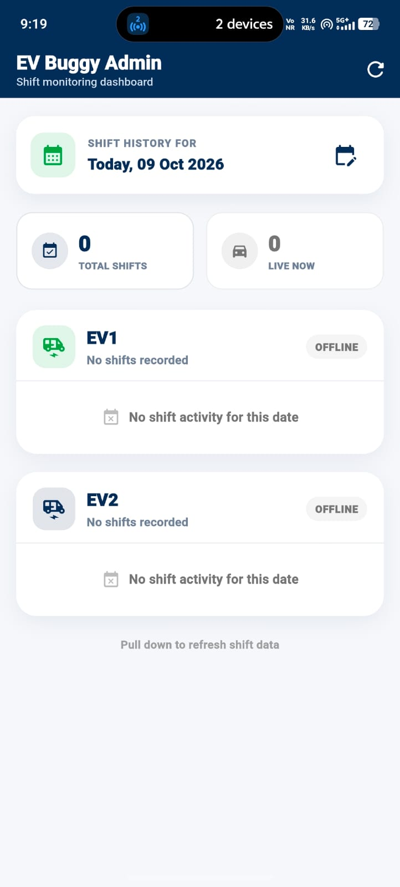
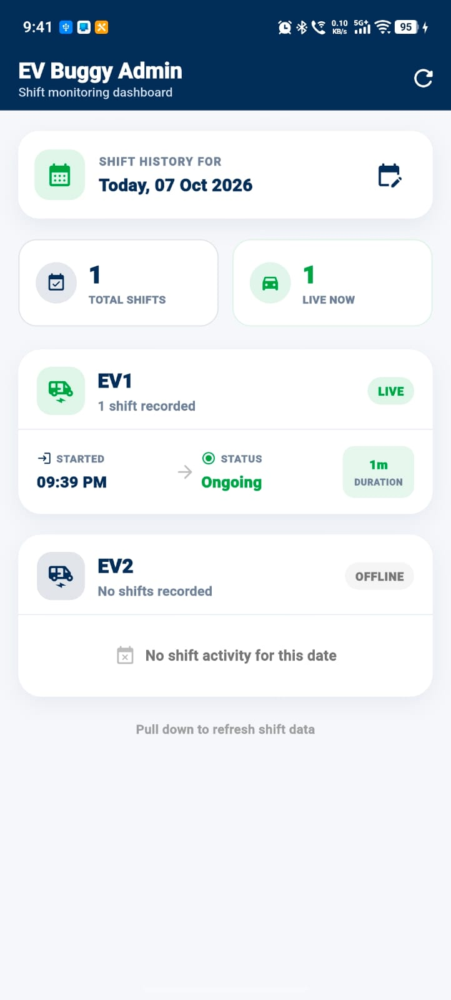

<div align="center">

# 🚌 VIT EV BUGGY

### Real-Time Campus Shuttle Tracking & Shift Management System

**A campus mobility solution developed for VIT Chennai.**

<p>
  
  
  
  
  
</p>

**🚗 Driver** &nbsp; → &nbsp; **🔥 Firebase** &nbsp; → &nbsp; **📍 Faculty** &nbsp; · &nbsp; **📊 Admin**

> **From a campus mobility need to a real-world implementation at VIT Chennai.**

</div>

---

## 🌟 About the Project

**VIT EV BUGGY** is a real-world campus shuttle tracking and management project developed for the **VIT Chennai campus**. It is designed around the needs of the people who use and operate the campus EV buggy service—not just as a standalone demonstration, but as a practical system intended for use in the campus environment.

The project brings together three connected applications:

- **Drivers** can select an EV, manage their shift, and publish live location updates.
- **Faculty members** can view EV movement, route progress, pickup status, and arrival information.
- **Administrators** can monitor daily shift records, including start and end times, duration, and ongoing shifts.

The three Flutter applications share a Firebase Realtime Database, allowing vehicle information and shift events to flow between the relevant users.

### 🎯 Who is it for?

<table>
<tr>
<td width="33%" valign="top">

### 🚗 EV Drivers

A simple interface to start or end a shift, select EV1 or EV2, and share live vehicle location while on duty.

</td>
<td width="33%" valign="top">

### 👨‍🏫 VIT Faculty

A way to follow campus EVs, understand route and pickup progress, and receive arrival notifications.

</td>
<td width="33%" valign="top">

### 🏫 Campus Administration

A daily view of vehicle shift activity to help monitor operations and review recorded shift history.

</td>
</tr>
</table>

---

## 🏫 Built for VIT Chennai

This project is focused on **campus-level implementation**: connecting the driver workflow, faculty-facing shuttle information, and administrative shift monitoring into one shared system.

Rather than treating these as three unrelated apps, VIT EV BUGGY links them through a common backend so that each application serves a different part of the same campus transport workflow.

**Implementation status:** The project is **being implemented at VIT Chennai**.

The goal is to support clearer shuttle visibility for faculty, a straightforward shift workflow for drivers, and more organized shift records for campus operations.

### 📸 The EV Buggy on Campus

<div align="center">



<sub>VIT Chennai EV Buggy</sub>

</div>

---

## ✨ Key Features

<table>
<tr>
<td width="33%" valign="top">

### 🚗 Driver App
- EV1 / EV2 selection
- Start and end shifts
- Live GPS tracking
- Active shift restoration
- Network status monitoring
- Automatic 30-minute shift limit

</td>
<td width="33%" valign="top">

### 📍 Faculty App
- Live EV location
- Route and pickup tracking
- Faculty block detection
- Arrival status
- Route-based ETA
- EV arrival notifications

</td>
<td width="33%" valign="top">

### 🛠️ Admin App
- Day-wise shift history
- Separate EV1 / EV2 records
- Shift start and end times
- Duration calculation
- Ongoing shift detection
- Daily shift overview

</td>
</tr>
</table>

---

## 🖼️ Application Showcase

### 🚗 Driver App

| Start Shift | Active Shift |
|:---:|:---:|
|  |  |

### 📍 Faculty App

| Live EV Map | Alternate Faculty Map View | Pickup / Arrival Status |
|:---:|:---:|:---:|
|  |  |  |

### 🛠️ Admin App

| Shift Dashboard | Shift History |
|:---:|:---:|
|  |  |

---

## 🧩 System Architecture

```text
                    ┌─────────────────────┐
                    │      DRIVER APP     │
                    │  Shifts + Live GPS  │
                    └──────────┬──────────┘
                               │
                               ▼
                    ┌─────────────────────┐
                    │ FIREBASE REALTIME DB│
                    │                     │
                    │ evShuttle/vehicles  │
                    │ evShuttle/shiftEvents
                    └──────────┬──────────┘
                               │
                  ┌────────────┴────────────┐
                  ▼                         ▼
        ┌──────────────────┐      ┌──────────────────┐
        │   FACULTY APP    │      │    ADMIN APP     │
        │ Live EV tracking │      │ Shift monitoring │
        └──────────────────┘      └──────────────────┘
```

### 🔥 Firebase at a Glance

The applications share the same Firebase Realtime Database:

```text
evShuttle/
├── vehicles/
│   ├── EV1
│   └── EV2
└── shiftEvents/
    └── <eventId>
```

- **`vehicles`** — current vehicle state, location, and operational status.
- **`shiftEvents`** — shift start/end events used by the Admin app.

---

## 🧰 Technology Stack

<table>
<tr>
<td align="center" width="25%">

### 📱 App Development
Flutter<br/>Dart

</td>
<td align="center" width="25%">

### ☁️ Backend
Firebase Core<br/>Realtime Database

</td>
<td align="center" width="25%">

### 🗺️ Mapping & Location
OpenStreetMap<br/>flutter_map<br/>Geolocator

</td>
<td align="center" width="25%">

### 🔔 Supporting Packages
SharedPreferences<br/>Flutter Local Notifications

</td>
</tr>
</table>

---

## 🌿 Repository Structure

The system is maintained as three separate Flutter applications on separate Git branches.

```text
VIT-EV-BUGGY
├── driver    → 🚗 Driver application
├── faculty   → 📍 Faculty application
└── admin     → 🛠️ Admin application
```

---

## ⚙️ Setup & Installation

### Prerequisites

- [Flutter SDK](https://docs.flutter.dev/get-started/install)
- Android Studio or another supported Flutter development environment
- A supported device or emulator
- Firebase configuration for the selected application

### 1. Clone the repository

```bash
git clone <REPOSITORY_URL>
cd <REPOSITORY_DIRECTORY>
```

### 2. Select an application branch

Each app is maintained on a separate branch. Check out the app you want to run:

```bash
git switch driver
```

For the Faculty or Admin app:

```bash
git switch faculty
# or
git switch admin
```

### 3. Install dependencies

From the Flutter project root on the selected branch:

```bash
flutter pub get
```

### 4. Configure Firebase

Verify that the selected app has the correct Firebase configuration for the shared project.

- **Android:** ensure `google-services.json` is in the expected Android app directory.
- **iOS:** configure `GoogleService-Info.plist` if running on iOS.
- Confirm that the app points to the intended Firebase Realtime Database.
- Do not expose private credentials or sensitive configuration.

Use the Firebase setup already present in each branch as the source of truth. Do not copy one app's platform configuration into another without checking its package or bundle identifier.

### 5. Run the application

Connect a supported device or start an emulator, then run:

```bash
flutter run
```

Repeat the steps for each application branch.

---

## 📚 Documentation

| Document | Purpose |
|---|---|
| **README.md** | Project overview, campus context, features, screenshots, architecture and setup |
| **[SDC.md](SDC.md)** | Detailed technical handover, file responsibilities, core logic, Firebase details and troubleshooting |

---

<div align="center">

## 🚌 Campus Mobility, Connected.

**🚗 Driver** → **🔥 Firebase** → **📍 Faculty**

**🚗 Driver** → **🔥 Firebase** → **📊 Admin**

*Designed for the VIT Chennai campus. Being implemented to support real campus shuttle operations.*

<sub>VIT EV BUGGY · Real-Time Campus Mobility System</sub>

</div>
